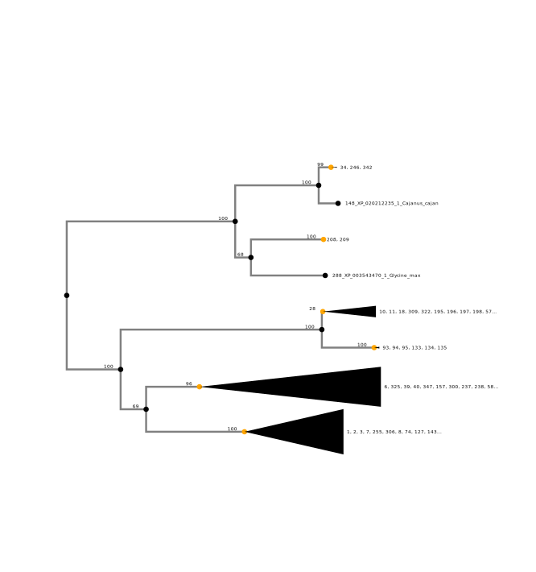

# GeneHummus

An Automated Pipeline to Classify Gene Families based on Protein Domain Organization using Auxin Response Factors in chickpea and other
Legumes as an Example

Phylogenetic analysis  

