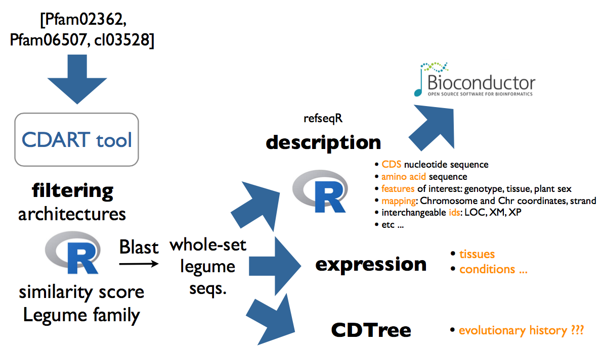
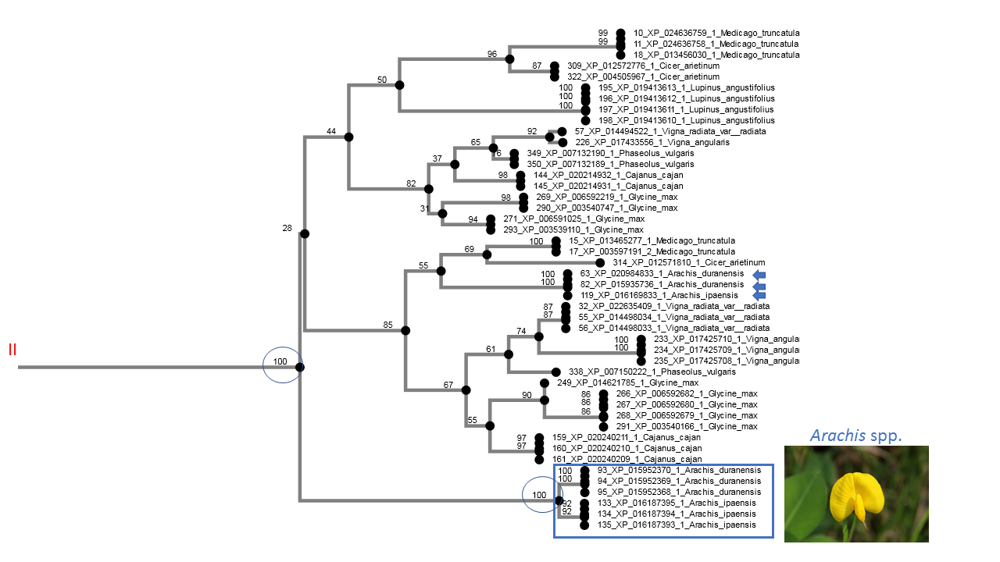

# GeneHummus

An Automated Pipeline to Study **Plant Gene Families based on Protein Domain Organization** using Auxin Response Factors in **chickpea** and other Legumes as an Example.

 - [Workflow](#workflow)
 - [CDART](#conserved-domain-architecture)
 - [Phylogeny](#phylogeny)
 - [Expression](https://github.com/NCBI-Hackathons/SimpleGeneExpression)

 

## Workflow

You can follow our [tutorial](tutorial.md) for a step-by-step sequences identification.  
  
  

## Conserved Domain Architecture  

In total, we have identified **563 Auxin Response Factor protein** sequences across **10 different Legume species**. 

| Species  | # ARF |
|---------|----------------|
| *Glycine max* | 86     |
| *Lupinus angustifolius* | 92 |
| *Arachis ipaensis* | 63
| *Arachis duranensis* | 57
| *Cajanus cajan* |  56
| *Vigna angularis* | 43
| *Vigna radiata* | 41
| ***Cicer arietinum*** | **45**
| *Medicago truncatula* | 52 
| *Phaseolus vulgaris* | 31

Question  
* What does this information tell us about the expansion of the ARF in Legumes? -in terms of gene duplications (early/ancestral)-      
* This distribution among legumes, suggests any idea about Genome-wide duplication (GWD) events in any species ?     

## Phylogeny  
* We have 3 main clusters, being cluster II and III more close-related. 
* Each cluster is made of a number of subclases or subgroups.   
* Vast majority of subclases are multi-species

A **subclass in cluster II is made only** of proteins from the genus ***Arachis*** with no homology to any other genera. This subclass is well-supported by bootstrap values. 

Questions  
* How many sister pairs are between two different species?   
* How many sister pairs are between the same species?   
* Proteins belonging the same group within a species, do they locate on the same chromosome?  

### Data Interpretation: 
The vast majority of ARF legume proteins were present in the last common ancestor before the species diverged from each other.     
  
Should we expect the **same evolutionary history with other gene family**? For example, resistance-like genes? Shouldn't we expect more species-specific clades meaning the certains challenges that each species has met during its evolutionary development?
